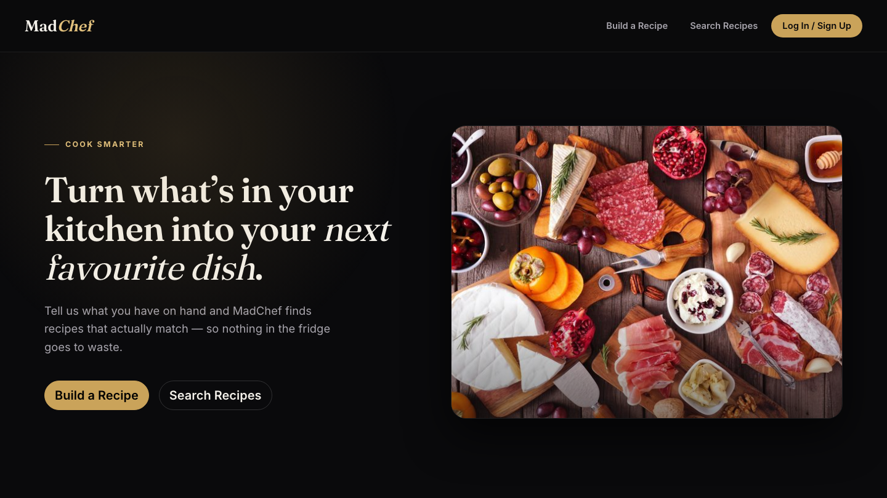
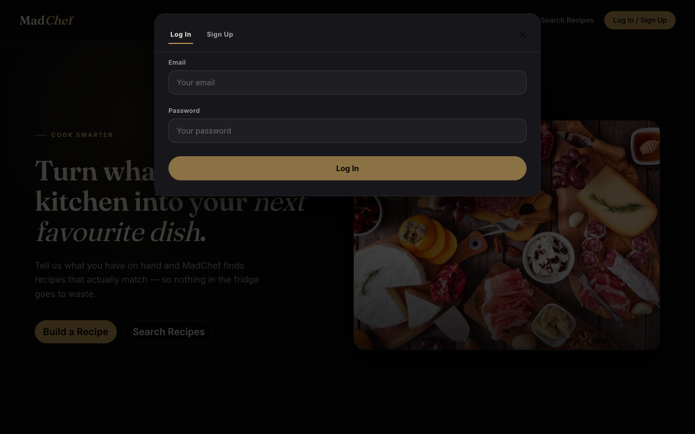
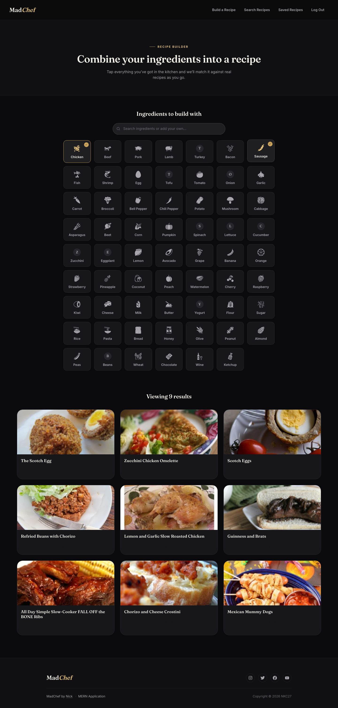
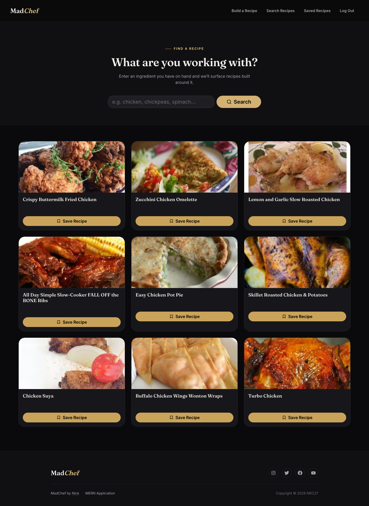
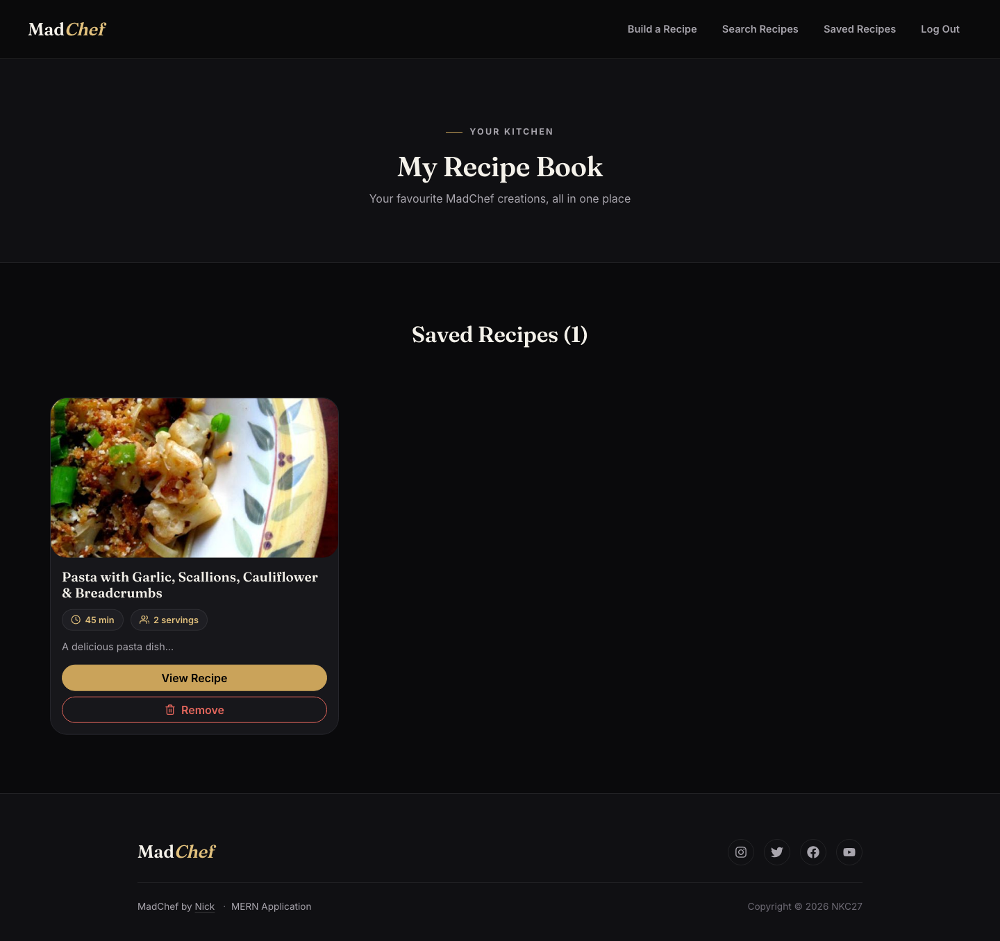
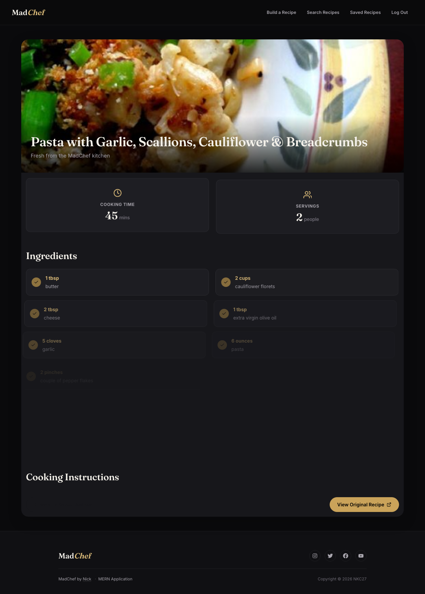

# MadChef 🍳




A full-stack recipe discovery platform built with **React, TypeScript, GraphQL/Apollo, Express and MongoDB**.

MadChef turns the ingredients you already have into recipes you can actually cook — search by name, or check off what's in your kitchen and get matching dishes back, powered by the Spoonacular API behind a GraphQL backend.


📂 **GitHub Repository**

<https://github.com/NKC27/MadChef-2.0>

🔗 **Live Demo**

<https://madchef-5qwv.onrender.com>

---

# Project Overview

MadChef started as a team-built MERN project and has since gone through two major passes by me: a full stack modernization (CommonJS/CRA → TypeScript/Vite, `apollo-server-express` v2 → Apollo Server 4, dependency cleanup) and a complete visual redesign (a dated Bootstrap-defaults look → a themed, dark/premium interface).

The project demonstrates:

- GraphQL API design and resolver architecture
- JWT authentication with hashed credentials
- Relational-style modelling of embedded documents in MongoDB
- Integration with a third-party REST API (Spoonacular) proxied server-side
- A from-scratch design system built on top of themed Bootstrap Sass
- Debugging real, non-obvious production-style bugs (see below)

This project demonstrates my ability to:

✅ Modernize a legacy JavaScript codebase to TypeScript without breaking behaviour
✅ Design and reason about a GraphQL schema shared between client and server
✅ Diagnose bugs that don't announce their real cause (an auth-looking bug that was actually a schema mismatch)
✅ Build a cohesive design system by theming a library at the Sass level rather than patching components one by one
✅ Verify UI work with real browser automation instead of just trusting the code

---

# Before / After

The screenshots below are from the same app, roughly two years apart in design maturity — the "before" set is the original team build, the "after" set is my redesign.

## Home

**Before**


**After**


## Recipe Builder

**Before**


**After**


## Search Recipes

**Before**


**After**


## Saved Recipes

**Before**


**After**


## Recipe Details *(new page — didn't exist in the original build)*



---

# Features

## Authentication

- User registration and login via GraphQL mutations
- Password hashing with bcryptjs
- JWT-based session auth, verified per-request on the server
- Protected mutations (saving/removing recipes) that reject unauthenticated requests

## Recipe Discovery

- Search recipes by ingredient name
- Visual ingredient picker — 60+ common ingredients with icon tiles, live search/filter, and free-text "add your own" for anything not in the preset list
- Full recipe detail view: ingredients, step-by-step instructions, cook time, servings
- Save/remove recipes to a personal recipe book, backed by MongoDB

---

# Technology Stack

## Frontend

- React 18 + TypeScript
- Vite
- React Router v6
- Apollo Client
- React Bootstrap 2 / Bootstrap 5 (themed via Sass, not the default build)
- GSAP (scroll/entrance animations)
- react-icons

## Backend

- Node.js + Express + TypeScript
- Apollo Server 4 (GraphQL)
- Mongoose 8 / MongoDB
- jsonwebtoken + bcryptjs
- Spoonacular API (server-side proxy — the key never reaches the browser)

---

# Application Architecture

MadChef is a single GraphQL API consumed by one React client — there's no REST layer and no separate admin app.

```text
                 Browser
                    |
                    v
         React + Apollo Client (Vite dev server)
                    |
                    | GraphQL over HTTP (/graphql)
                    v
         Express + Apollo Server 4
                    |
        --------------------------
        |                        |
        v                        v
  Mongoose / MongoDB      Spoonacular REST API
  (users, saved recipes)  (recipe search & details)
```

Auth flows through an Express middleware that verifies the JWT on every request and attaches the decoded user to GraphQL context — resolvers check `context.user` rather than re-verifying tokens themselves.

---

# Database Design

MongoDB via Mongoose, with recipes stored as embedded subdocuments on the user rather than a separate collection with a foreign key — a user's saved recipes are only ever read in the context of that user, so there's no need for a join.

```text
User
 ├─ username, email, password (hashed)
 └─ savedRecipes: [Recipe]
     ├─ recipeId, title, description
     ├─ image, link
     └─ readyInMinutes, servings
```

`recipeCount` is a Mongoose virtual computed from `savedRecipes.length` rather than a stored field, so it can never drift out of sync with the actual array.

---

# Engineering Notes

This project involved two rounds of real debugging and one full visual rebuild — the interesting parts weren't the boilerplate, they were the bugs that didn't look like what they actually were.

## A race condition that only failed sometimes

Signup and login intermittently failed with `secretOrPrivateKey must have a value` — but only sometimes, from the same code, with the same `.env` file. The cause: `utils/auth.ts` read `process.env.JWT_SECRET` into a module-level constant at *import* time, which raced against the `dotenv.config()` call in `server.ts` under `tsx`'s watch-mode loader. Whichever finished first depended on the run. Fixed by reading the env var lazily inside `signToken`/`authMiddleware` instead of caching it — the value is now read at call time, not load time, so there's nothing left to race.

## An auth bug that wasn't an auth bug

The Saved Recipes page showed *"Your session may have expired. Please log in again"* — but the token was fine. The actual cause was a schema mismatch: the client's `GET_ME` query asked for `readyInMinutes` and `servings` on saved recipes, but neither the GraphQL `Recipe` type nor the Mongoose schema defined those fields, so Apollo Server rejected the query outright with a validation error before it ever touched auth. The client's error boundary just mislabeled every `GET_ME` failure as a session problem. Fixed by adding the missing fields to both the GraphQL schema and the Mongoose model, and diagnosed by querying the API directly with `curl` rather than trusting what the UI reported.

## One CSS rule, breaking headings site-wide

A single unscoped selector in `footer.scss` —

```scss
h1, h2, h3, h4, h5, h6 { color: white !important; }
```

— sat outside its intended `.footer` wrapper, so it force-whited every heading on every page, `!important` overriding any other color. Confirmed with a real headless-browser check of computed styles (not just reading the source), then fixed by scoping the rule to `.footer` where it was always meant to live.

## Re-theming Bootstrap instead of overriding it

Rather than patch every `Button`, `Card`, `Modal`, and `Form.Control` individually for the dark redesign, I switched the app from importing Bootstrap's compiled CSS to compiling Bootstrap from source with Sass variable overrides (`$primary`, `$card-bg`, `$border-radius`, etc.) applied before `@import 'bootstrap/scss/bootstrap'`. Every stock component now inherits the palette automatically, so new UI built with plain `variant="primary"` stays on-brand without extra CSS.

---

# Local Installation

You'll need Node 18+ and a MongoDB instance (local or Atlas).

Clone the repository:

```bash
git clone https://github.com/NKC27/MadChef-2.0.git
cd MadChef-2.0
npm install
```

Set up environment variables:

```bash
cp server/.env.example server/.env
```

```env
SPOONACULAR_API_KEY=your_spoonacular_api_key
JWT_SECRET=replace_with_a_long_random_string
MONGODB_URI=mongodb://127.0.0.1:27017/madchef
```

Run client and server together in development:

```bash
npm run dev
```

This starts the Vite dev server (client) and the GraphQL API (server) side by side, with the client proxying `/graphql` requests to the server.

```text
http://localhost:5173
```

Other useful scripts:

```bash
npm run build       # builds server (tsc) and client (vite build)
npm run typecheck   # type-checks both workspaces
npm start           # runs the compiled server (serves the built client too)
```

---

# Future Improvements

- Automated test coverage (currently none — the app has been verified manually and via ad-hoc browser automation, not a real suite)
- Code-splitting the client bundle (the full themed Bootstrap build plus icon set currently ships as one ~650KB chunk)
- Persist ingredient search history in the Recipe Builder
- CI pipeline running typecheck/build on every PR

---

# Credits

Original team: Ryan ([@Ryocon](https://github.com/Ryocon)),
Nick ([@NKC27](https://github.com/NKC27)),
Sikander ([@sikandersultan](https://github.com/sikandersultan)).

Stack modernization, bug fixes, and the full visual redesign by Nicholas Clarke.

## Developer

**Nick Clarke**

GitHub: <https://github.com/NKC27>

---

⭐ This project demonstrates taking over an unfamiliar, dated codebase — modernizing its tooling, fixing bugs that actively misled diagnosis, and rebuilding its interface into something that looks intentionally designed rather than assembled from defaults.
